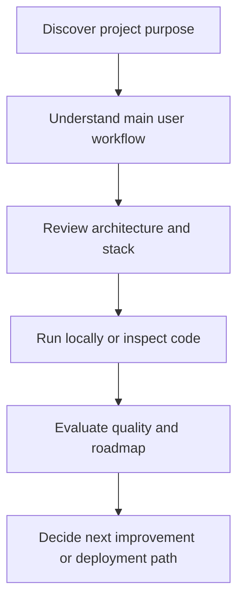
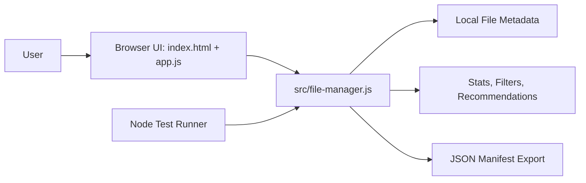
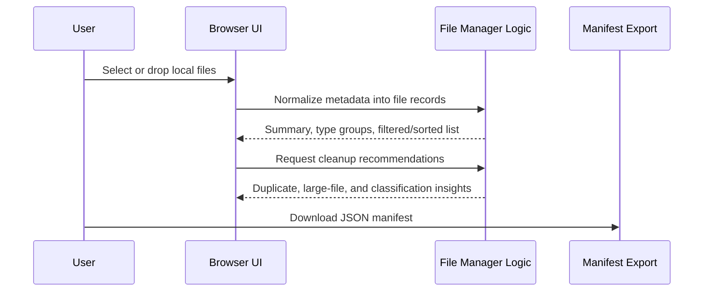

<div align="center">

# FileManager — Smart Local File Manager\n
### Smart local-first browser file manager for analysis, search, cleanup recommendations, and manifest export.


**Repository:** [bhedanikhilkumar-code/FileManager](https://github.com/bhedanikhilkumar-code/FileManager)

<!-- REPO_HEALTH_BADGE_START -->
[](https://github.com/bhedanikhilkumar-code/FileManager/actions/workflows/repository-health.yml)
<!-- REPO_HEALTH_BADGE_END -->

<!-- APP_QUALITY_BADGE_START -->
[](https://github.com/bhedanikhilkumar-code/FileManager/actions/workflows/app-quality.yml)
<!-- APP_QUALITY_BADGE_END -->

</div>

---

## Executive Overview

FileManager is now a working **local-first browser utility**. It lets users select or drag files into the browser, inspect file metadata, search and sort files, understand storage usage, find duplicate/large-file cleanup opportunities, and export a portable JSON manifest.

The project was upgraded from a docs-only repository into a real portfolio-ready app with vanilla JavaScript modules, responsive UI, Node.js unit tests, project validation, and GitHub Actions quality checks.


## Recruiter Quick Scan

| What to look for | Why it matters |
| --- | --- |
| **Local-first browser app** | No server needed - shows vanilla JS skills |
| **File analysis** | Metadata, size, duplicate detection |
| **Zero dependencies** | Clean, lightweight codebase |
| **Responsive UI** | Modern CSS with dark theme |
| **CI quality checks** | GitHub Actions workflow |

### Key Features

| Feature | Description |
| --- | --- |
| Drag & drop | Select files in browser |
| File metadata | Size, type, date info |
| Search | Find files by name |
| Cleanup recommendations | Large files, duplicates |
| Manifest export | JSON export |

---


## Product Positioning

| Question | Answer |
| --- | --- |
| **Who is it for?** | Users, reviewers, recruiters, and developers who want to understand the project quickly. |
| **What problem does it solve?** | It helps users understand a folder/file selection quickly without uploading private files to a server. |
| **Why it matters?** | The project demonstrates product thinking, stack selection, feature planning, and clean documentation discipline. |
| **Current focus** | Working browser prototype, local metadata analysis, test coverage, and CI-backed repository quality. |

## Repository Snapshot

| Area | Details |
| --- | --- |
| Visibility | Public portfolio repository |
| Primary stack | `HTML5`, `CSS3`, `Vanilla JavaScript`, `Node.js tests` |
| Repository topics | `file-manager`, `productivity`, `utility`, `browser-app`, `vanilla-javascript` |
| Useful commands | `npm start`, `npm test`, `npm run check` |
| Key dependencies | Zero runtime dependencies; Node.js is used for local preview and tests |

## Topics

`file-manager` · `productivity` · `utility`

## Key Capabilities

| Capability | Description |
| --- | --- |
| **Local file analysis** | Uses browser file metadata to summarize selected files without uploading contents. |
| **Search, filter, and sort** | Quickly narrows large selections by name, path, type, size, and modified state. |
| **Cleanup recommendations** | Flags duplicate candidates, large files, unknown file types, and dominant file groups. |
| **Manifest export** | Exports a structured JSON inventory for audits, backups, and review workflows. |
| **Tested core logic** | File classification, filtering, sorting, summarization, and manifest generation are covered by Node tests. |

<!-- PROJECT_DOCS_HUB_START -->

## Documentation Hub

| Document | Purpose |
| --- | --- |
| [Architecture](docs/ARCHITECTURE.md) | System layers, workflow, data/state model, and extension points. |
| [Case Study](docs/CASE_STUDY.md) | Product framing, decisions, tradeoffs, and portfolio story. |
| [Roadmap](docs/ROADMAP.md) | Practical next steps for turning the project into a stronger product. |
| [Quality Standard](docs/QUALITY.md) | Repository health checks, review standards, and quality gates. |
| [Review Checklist](docs/REVIEW_CHECKLIST.md) | Final share/recruiter review checklist for a stronger GitHub impression. |
| [Contributing](CONTRIBUTING.md) | Branching, commit, review, and quality guidelines. |
| [Security](SECURITY.md) | Responsible disclosure and safe configuration notes. |
| [Support](SUPPORT.md) | How to ask for help or report issues clearly. |
| [Code of Conduct](CODE_OF_CONDUCT.md) | Collaboration expectations for respectful project activity. |

<!-- PROJECT_DOCS_HUB_END -->

## Detailed Product Blueprint

### Experience Map



### Feature Depth Matrix

| Layer | What reviewers should look for | Why it matters |
| --- | --- | --- |
| Product | Clear user problem, target audience, and workflow | Shows product thinking beyond tutorial-level code |
| Interface | Screens, pages, commands, or hardware interaction points | Demonstrates how users actually experience the project |
| Logic | Validation, state transitions, service methods, processing flow | Proves the project can handle real use cases |
| Data | Local storage, database, files, APIs, or device input/output | Explains how information moves through the system |
| Quality | Tests, linting, setup clarity, and roadmap | Makes the project easier to trust, extend, and review |

### Conceptual Data / State Model

| Entity / State | Purpose | Example fields or responsibilities |
| --- | --- | --- |
| User input | Starts the main workflow | Form values, commands, uploaded files, device readings |
| Domain model | Represents the project-specific object | Transaction, note, shipment, event, avatar, prediction, song, or task |
| Service layer | Applies rules and coordinates actions | Validation, scoring, formatting, persistence, API calls |
| Storage/output | Keeps or presents the result | Database row, local cache, generated file, chart, dashboard, or device action |
| Feedback loop | Helps improve the next interaction | Status message, analytics, error handling, recommendations, roadmap item |

### Professional Differentiators

- **Documentation-first presentation:** A reviewer can understand the project without guessing the intent.
- **Diagram-backed explanation:** Architecture and workflow diagrams make the system easier to evaluate quickly.
- **Real-world framing:** The README describes users, outcomes, and operational flow rather than only listing files.
- **Extension-ready roadmap:** Future improvements are scoped so the project can keep growing cleanly.
- **Portfolio alignment:** The project is positioned as part of a consistent, professional GitHub portfolio.

## Architecture Overview



## Core Workflow



## How the Project is Organized

```text
FileManager/
├── index.html                         # Browser entry point
├── package.json                       # Node scripts for preview, tests, and validation
├── src/
│   ├── app.js                         # DOM events, rendering, drag/drop, export flow
│   ├── file-manager.js                # Pure file metadata logic and recommendations
│   └── styles.css                     # Responsive dark UI styling
├── tests/
│   └── file-manager.test.mjs          # Node unit tests for core logic
├── scripts/
│   ├── serve.mjs                      # Dependency-free local static server
│   └── validate-project.mjs           # Portfolio/project structure validation
├── .github/workflows/
│   ├── app-quality.yml                # Node test + validation CI
│   └── repository-health.yml          # Documentation/community health CI
└── docs/                              # Architecture, case study, roadmap, quality notes
```

## Engineering Notes

- **Separation of concerns:** UI, business logic, data/services, and platform concerns are documented as separate layers.
- **Scalability mindset:** The project structure is ready for new screens, services, tests, and deployment improvements.
- **Portfolio quality:** README content is designed to communicate value before someone even opens the code.
- **Maintainability:** Naming, setup steps, and roadmap items make future work easier to plan and review.
- **User-first framing:** Features are described by the value they provide, not just the technology used.

## Local Setup

```bash
# Clone the repository
git clone https://github.com/bhedanikhilkumar-code/FileManager.git
cd FileManager

# Run the automated tests
npm test

# Validate repository/project structure
npm run check

# Start the local preview server
npm start
# Open http://localhost:4173
```

## Suggested Quality Checks

Before shipping or presenting this project, run the checks that match the stack:

| Check | Purpose |
| --- | --- |
| `npm test` | Runs Node.js unit tests for file classification, filtering, sorting, summaries, and manifest export. |
| `npm run check` | Validates the expected app, docs, workflow, and README structure. |
| GitHub Actions `app-quality.yml` | Runs tests and validation on every push/PR. |
| GitHub Actions `repository-health.yml` | Checks documentation, templates, and professional repo files. |
| Manual smoke test | Select files, search/filter/sort, review recommendations, and export a manifest. |

## Roadmap

- Add folder tree visualization from `webkitRelativePath` metadata
- Add file-type storage charts and quick cleanup buckets
- Add optional File System Access API integration for supported browsers
- Add import flow for previously exported manifests
- Add Playwright smoke tests for browser-level interactions

## Professional Review Checklist

- [x] Clear project purpose and audience
- [ ] Feature list aligned with real user workflows
- [ ] Architecture documented with diagrams
- [ ] Setup steps tested on a clean machine
- [ ] Screenshots or demo GIFs added where possible
- [ ] Environment variables documented without exposing secrets
- [ ] Tests/lint commands documented
- [ ] Roadmap shows practical next steps

## Screenshots / Demo Notes

| Asset | Status |
| --- | --- |
| Working prototype | Live at local index.html |
| CLI tests | npm test |
| Workflow GIF | Future improvement | when available to make the repository even stronger:

| Asset | Recommended content |
| --- | --- |
| Hero screenshot | Main dashboard, home screen, or landing page |
| Workflow GIF | 10-20 second walkthrough of the core feature |
| Architecture image | Exported version of the Mermaid diagram |
| Before/after | Show how the project improves an existing workflow |

## Contribution Notes

This project can be extended through focused, well-scoped improvements:

1. Pick one feature or documentation improvement.
2. Create a small branch with a clear name.
3. Keep changes easy to review.
4. Update this README if setup, features, or architecture changes.
5. Open a pull request with screenshots or test notes when possible.

## License

Add or update the license file based on how you want others to use this project. If this is a portfolio-only project, document that clearly before accepting external contributions.

---

<div align="center">

**Built and documented with a focus on professional presentation, practical workflows, and clean engineering communication.**

</div>
