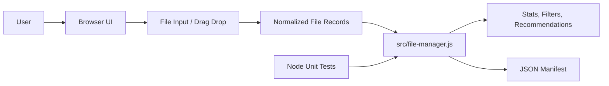
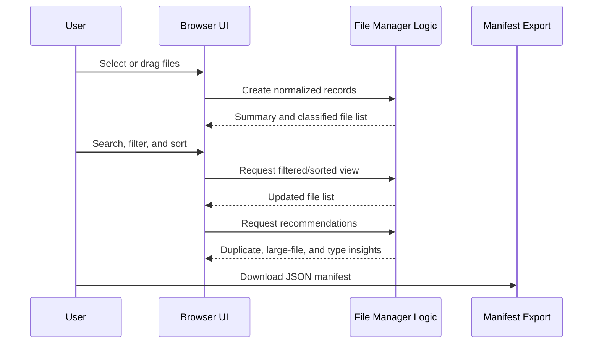
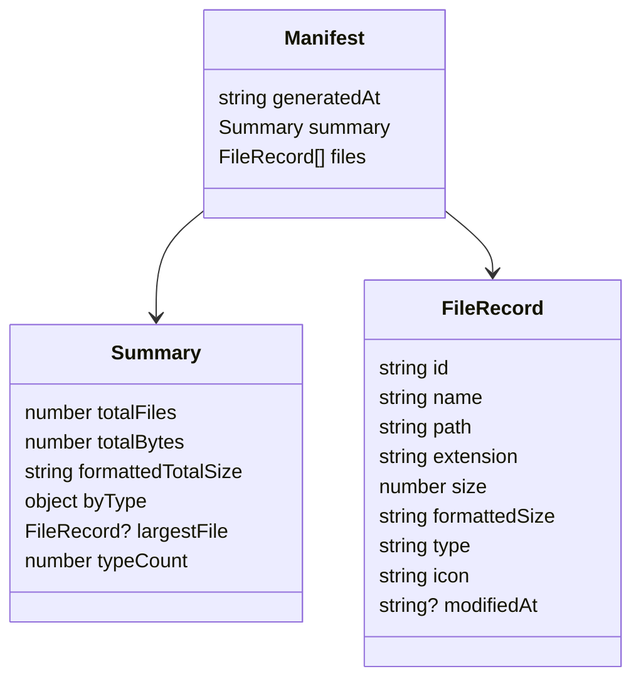

# Architecture — FileManager

## Purpose

FileManager is a local-first browser prototype for analyzing selected files without uploading file contents. It turns browser file metadata into searchable records, storage summaries, cleanup recommendations, and an exportable JSON manifest.

## System Context

## Runtime Boundaries

| Boundary | Responsibility | Notes |
| --- | --- | --- |
| Browser UI | Presents upload/drop zone, filters, stats, recommendations, and file list | Implemented in `index.html`, `src/app.js`, and `src/styles.css` |
| File metadata | Uses `File` object metadata from the browser | File contents are not uploaded or persisted |
| Core logic | Pure functions for classification, formatting, filtering, sorting, and recommendations | Implemented in `src/file-manager.js` and covered by tests |
| Export | Creates a portable JSON manifest from selected metadata | Runs entirely in the browser |
| Quality layer | Unit tests and project validation | `npm test`, `npm run check`, and GitHub Actions |

## Primary Workflow

## Core Modules

| Module | Role |
| --- | --- |
| `index.html` | Semantic app shell and accessible controls |
| `src/app.js` | DOM orchestration, event handling, rendering, sample workspace, manifest download |
| `src/file-manager.js` | Pure file metadata functions: classify, format, filter, sort, summarize, recommend, export |
| `src/styles.css` | Dark responsive portfolio UI |
| `tests/file-manager.test.mjs` | Node tests for core behavior |
| `scripts/serve.mjs` | Dependency-free local preview server |
| `scripts/validate-project.mjs` | Project structure and README validation |

## Data Model

## Quality Gates

- `npm test` validates core logic with Node's built-in test runner.
- `npm run check` validates expected app, docs, and workflow files.
- `.github/workflows/app-quality.yml` runs tests and validation on push/PR.
- `.github/workflows/repository-health.yml` validates professional repository files.

## Security and Privacy Notes

- The prototype uses browser-provided metadata and does not upload files.
- Manifest export contains file names, sizes, paths, types, and modified timestamps; users should review before sharing.
- Future File System Access API integration should remain explicit, permission-based, and documented.
